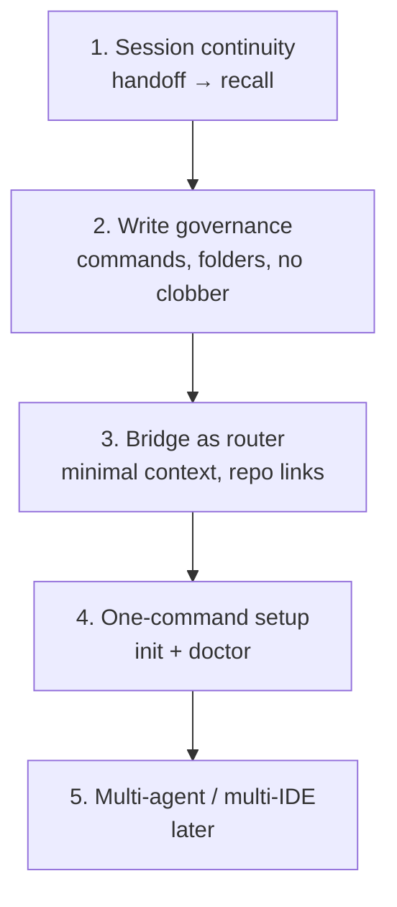

Yes — there’s a growing ecosystem, but it splits into **three layers**. Grounder sits in layer 2, and that’s where the interesting comparisons are.

## Three layers

| Layer | What it does | Examples |
|---|---|---|
| **Transport** | Agent ↔ vault I/O (read/write/search) | MCPVault, obsidian-mcp, mcp-obsidian |
| **Workflow / memory** | Vault structure, project linking, session lifecycle | markdown-memory, mnemex, claude-obsidian-memory |
| **Obsidian UI** | Run agents *inside* Obsidian | Agent Client, Agentic Copilot |

Grounder is **workflow + wiring**, not transport. Your plan already uses `@bitbonsai/mcpvault` for I/O and focuses on `npx grounder init` to set up the rest.

---

## Closest cousins (most like Grounder)

**1. [markdown-memory](https://github.com/mworldorg/markdown-memory)** (`npx markdown-memory`)  
- Shared Obsidian vault as long-term memory across claude.ai ↔ Claude Code  
- Per-project **passport**, **handoff**, session logs  
- Skills/commands for start/resume/handoff lifecycle  
- **Similar intent**; less Cursor-specific, more Claude Code–centric

**2. [mnemex](https://github.com/mouadja02/mnemex)**  
- `mnemex init-vault` + `mnemex init-project` — almost the same two-step model  
- Wires repo → vault, ships `doctor`, lint, ingest  
- Expects Obsidian REST API plugin for health checks  
- **Closest structural match** to Grounder’s init flow

**3. [claude-obsidian-memory](https://github.com/jgcosme/claude-obsidian-memory)**  
- Personal vault + optional **project-vault** registry (`projects.json`)  
- Lifecycle hooks (SessionStart/End) auto-load context, write memories back  
- Federated: project docs stay in project git, personal vault stays separate  
- **Same “split vault” idea** as Grounder; hook-driven vs slash-command-driven

**4. [obsidian-agent-memory-skills](https://github.com/AdamTylerLynch/obsidian-agent-memory-skills)**  
- `npx … init` scaffolds vault, auto-detects git repo  
- `analyze` hydrates vault from codebase; `recap` writes session summaries  
- Graph traversal, ADRs, component notes  
- More **auto-analysis**; less opinionated session protocol

**5. [codex-vault](https://github.com/mateo-bolanos/codex-vault)** (`npx codex-vault init`)  
- Scaffolds `ai/` inside the **repo itself** (plans, backlog, agents)  
- Codex-specific subagent pipeline  
- **Opposite storage model**: vault lives in git, not a personal vault

---

## Transport-only (what Grounder deliberately doesn’t rebuild)

These give agents file access but **no project workflow**:

- **[MCPVault](https://github.com/bitbonsai/mcpvault)** — filesystem MCP, safe frontmatter, BM25 search (your plan’s choice)
- **[obsidian-mcp](https://github.com/StevenStavrakis/obsidian-mcp)** — simple filesystem MCP (~700★)
- **[lstpsche/obsidian-mcp](https://github.com/lstpsche/obsidian-mcp)** — Rust, fast indices, semantic search
- **[mcp-obsidian](https://github.com/MarkusPfundstein/mcp_obsidian)** — REST plugin, popular but maintenance mode

Two access patterns: **direct filesystem** (no Obsidian running) vs **REST plugin** (richer, Obsidian must be open).

---

## How they work (pattern summary)

```
┌─────────────┐     MCP / hooks / skills     ┌──────────────────┐
│  Git repo   │ ◄──────────────────────────► │ Personal vault   │
│  (marker)   │   bridge note, registry      │ logs/plans/notes │
└─────────────┘                              └──────────────────┘
       │                                              ▲
       └──── agent reads repo code ──────────────────┘
              agent writes memory to vault only
```

Most mature systems share:

1. **Structured vault** — folders + templates + frontmatter  
2. **Project registry** — map repo name/path → vault folder  
3. **Session lifecycle** — start (load context) → work → handoff (write log)  
4. **Agent procedure** — skills, hooks, or slash commands telling the agent *where* to read/write  
5. **MCP or filesystem** — actual I/O layer

---

## Where Grounder differs

| Aspect | Typical project | Grounder |
|---|---|---|
| Vault location | In-repo (`ai/`) or standalone wiki | **Personal vault**, repo gets marker only |
| Init UX | One command or manual setup | **Two-step**: `vault init` once, `init` per repo |
| Agent integration | Claude Code hooks/skills | **Cursor-first**: slash commands + rule + skill |
| Transport | Often bundled | **Delegates to MCPVault** |
| Write governance | Varies | Explicit router (`/x-task` → logs only, etc.) |

---

## Takeaway

**Nobody owns this space yet.** Transport is commoditized (half a dozen MCP servers). The real product is the **workflow kit + init CLI** — and that’s fragmented:

- **mnemex** and **markdown-memory** are the nearest peers  
- **claude-obsidian-memory** validates the federated vault model  
- **codex-vault** shows the in-repo alternative (simpler, but personal docs end up in git)

Grounder’s bet — personal vault, repo marker, opinionated `/x-*` lifecycle, Cursor wiring — is a coherent niche. The gap in the market isn’t “connect Obsidian to AI” (solved); it’s **“one command to wire any repo into my existing dev vault with guardrails.”**


---

## Where value actually is

**Init is necessary, not sufficient.** MCP servers and vault scaffolds are commoditized. Developers don’t pay for “Obsidian connected to AI” — they pay for **sessions that don’t start cold and don’t end messy**.

Grounder’s maximum value is in the **session loop**, not the wiring:

```
/x-task → work → /x-task-handoff → next /x-task
```

If that loop is reliable, init becomes a one-time tax. If it isn’t, init is just another abandoned dotfile.

---

## Differentiate on what hurts today

### 1. Governed memory (strongest moat)

Most tools give agents **unrestricted vault write**. That leads to bloated notes, wrong folders, chat dumps saved as “memory.”

Your plan already has the right instinct:
- slash commands only (no loose triggers)
- strict folder separation (`logs/` vs `notes/` vs `plans/`)
- no overwrites
- chat ≠ vault unless explicit

**Lean into this.** Position Grounder as *“agent memory with guardrails”* — not another second brain. Developers trust it because the agent **can’t** mess up their vault.

### 2. Precision recall (token-efficient context)

Competitors often bulk-read the vault or dump README into context. Developers feel this as slow starts and wasted tokens.

Maximum value: **`/x-task` loads the minimum useful context**:
- bridge note (project map)
- latest handoff log
- open TODOs from frontmatter
- links to repo truth (`AGENTS.md`, `.ai/plans/`) — don’t duplicate

The bridge note is the product. It should be a **router**, not a dump. Auto-refresh repo links on `grounder status --refresh` would compound value over time.

### 3. Personal vs repo split (architectural clarity)

This is your clearest structural differentiator vs codex-vault / in-repo `ai/` folders:

| Lives in git | Lives in personal vault |
|---|---|
| `AGENTS.md`, team docs, `.ai/plans/` | session logs, handoffs, scratch notes |
| `.grounder.json` (marker only) | decisions you haven’t committed yet |

Developers constantly confuse “where should the agent write?” Grounder answers that **by design**. Message: *team truth in repo, personal continuity in vault*.

### 4. Multi-project orientation

One dev, 5–20 repos, one vault. Pain: agent loads wrong project context.

`projects.json` + bridge + `.grounder.json` is the right model. Differentiate by making **`grounder status` and `/x-task` always resolve the active repo correctly** — including after branch switches, renames, moved folders.

mnemex and markdown-memory touch this; none own it for Cursor multi-repo workflows.

### 5. Operational reliability (`doctor`)

Underrated. Developers abandon tools when MCP breaks, paths drift, sandbox blocks writes.

Your MCP-first + `doctor` decision is high value. Make `doctor` the **“why isn’t my agent remembering?”** command. That’s support you don’t have to give manually.

---

## Where NOT to compete

| Skip | Why |
|---|---|
| Building another MCP server | MCPVault et al. are fine |
| Embeddings / RAG | Heavy, crowded; MCP search enough for v1 |
| Obsidian plugins / in-app agents | Different product (Agent Client territory) |
| 40+ slash commands | obsidian-second-brain already; scope creep |
| Sync/hosting service | User’s Obsidian Git; huge scope |

Stay **thin transport, thick workflow**.

---

## Value stack (priority order)



**Ship v1 for layers 1–4.** Layer 5 (Claude Code hooks, Windsurf) is expansion, not differentiation.

---

## Concrete “maximum value” bets for v1+

1. **Handoff quality** — template + enforcement so every session ends with: what changed, what’s next, blockers, branch. This is what developers feel day 2.

2. **Branch-aware logs** (v1.1) — `logs/2026-06-26-feature-auth.md` or frontmatter `branch:`. Agents forget which branch context applies; this is a real pain competitors ignore.

3. **`grounder status --refresh`** — re-scan repo, update bridge tables (new plans, changed `AGENTS.md`), without touching user notes.

4. **Decision capture → optional promote to repo** — vault holds draft ADR; developer promotes to `docs/decisions/` when ready. Bridges personal thinking → team artifact.

5. **Strict “recall budget” in skill** — e.g. “read at most 3 vault files at session start.” Makes agents fast and predictable.

---

## One-line positioning

> **Grounder: governed agent memory for developers — personal vault continuity without polluting your repo or your notes.**

Init gets you installed. **Governed handoffers** get you kept.

---

## Honest gap to watch

Right now Grounder is **Cursor-first + manual slash discipline**. Maximum long-term value requires the governance to work even when:
- user forgets `/x-task-handoff`
- agent is lazy and tries direct writes
- user switches to Claude Code on same vault

If you nail session continuity + write governance, expanding to hooks/CLI (`grounder handoff`) is natural. If you only nail init, you’re mnemex with a nicer Cursor template.

Want to pressure-test the v1 scope against this — e.g. what to cut from the plan vs what to elevate?
