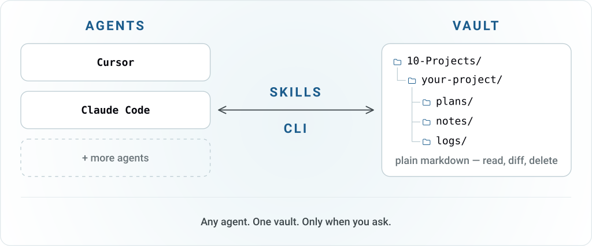
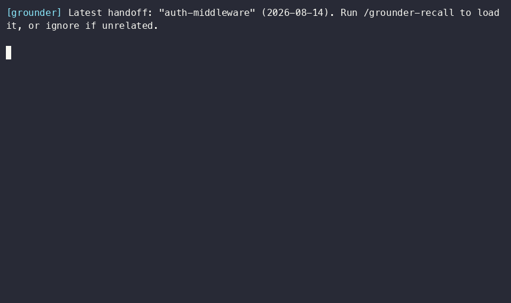

<div align="center">

# Grounder

**Obsidian vault memory for Cursor and Claude Code.**  
Session summaries, plans, and notes in files you own.

<picture>
  <source media="(prefers-color-scheme: dark)" srcset="docs/assets/what-dark.svg">
  
</picture>

<div>&nbsp;</div>

[](https://www.npmjs.com/package/grounder)
[](https://github.com/andrej-kolic/grounder/actions/workflows/ci.yml)
[](LICENSE)

</div>

**Grounder** keeps agent memory in plain markdown on disk — an Obsidian vault, or any
directory. Because it's files instead of chat history, work started in Cursor can be
picked up in Claude Code, weeks later, on a different machine.

The daily loop is five skills, typed as `/name` — [examples](#examples) show what you type.

## The problem

- **Every new chat starts from scratch.** Close the window and the next session has no idea what you just decided.
- **Cursor and Claude Code don't share context.** Decisions from one stay trapped in that tool's chat history.
- **You can't find the plan.** Implementation plans and decisions end up buried in a chat transcript, or in whatever directory some tool chose for you.

## What you get

- **Files, not a service** — plain markdown on disk: open it, diff it, delete it. No database or background process.
- **One vault, every project** — each linked project gets its own folder. A git repo or a plain folder both work.
- **Plans live, sessions accumulate** — a plan updates in place across sessions; notes and handoffs are dated files, kept to go back to. `search` ranks across all of them.
- **Deliberate** — nothing is read or written until you run a command. No auto-capture, no RAG, no tokens spent otherwise.
- **Follows you across machines** — the vault is just a folder, so git (or Syncthing, or Dropbox) is all the sync you need.
- **Cursor and Claude Code today** — skills for both; more agents on the [roadmap](#roadmap).

**Requirements:** Node.js 22+ and a folder to keep the files in — an existing Obsidian
vault, or an empty directory Grounder fills over time. Git is optional.

## Install

```bash
npm install -g grounder
```

Or let an agent handle install and setup:

```bash
npx skills add andrej-kolic/grounder --skill grounder-setup -g
```

Adding the skill only loads instructions — it does **nothing** until you ask your agent to
run it (e.g. "set up grounder"). Skip the global install entirely with
`npx grounder --help`, at the cost of re-running `grounder migrate` after each upgrade.

## Quickstart

```bash
# Once per machine — connect to a vault + install agent skills
grounder setup <path-to-your-vault> --hooks

# Once per project folder
cd your-project
grounder link
```

Both commands preview what they'll write and ask to confirm. Add `--yes` to skip the
prompt or `--dry-run` to see the preview without writing. `--hooks` is optional and adds a
one-line reminder at session start when a saved session exists — see
[session-start hooks](docs/session-hooks.md).

## Daily use

Work from the agent's chat. A typical loop starts by resuming the last saved session and
ends by saving a short summary.

Anything after the skill name is an instruction, not file content. The agent follows
it — writes a plan, saves a note, or searches the vault. `/grounder-task` and
`/grounder-task-handoff` don't need text at all.

### Examples

A typical session:

| You type | What it does |
| -------- | ------------ |
| `/grounder-task` | Resume the latest saved session |
| `/grounder-plan save insights from this session as an implementation plan with steps` | Write a named plan |
| `/grounder-search decisions and discussions on token refresh` | Search the vault |
| `/grounder-note explain why we rejected cookie sessions` | Save a new note |
| `/grounder-task-handoff` | Save a short session summary |

Later, update the living plan or resume a named session:

| You type | What it does |
| -------- | ------------ |
| `/grounder-plan update the auth rewrite plan — jwt validator is done` | Update an existing plan |
| `/grounder-task resume the auth-middleware session` | Resume a specific saved session, not the latest |

### Demo



## How it works

Three things, and that's the whole model:

1. **One vault per machine.** `grounder setup` records the vault path in
   `~/.grounder/config.json`. Nothing else on the machine needs to know where it is.
2. **One folder per project.** `grounder link` writes a two-line `.grounder.json`
   (safe to commit) into the project and creates the matching folder in the vault. That
   marker is how every later command knows where to read and write.
3. **Three document types**, each with a fixed shape so agents produce consistent files:

```text
10-Projects/your-project/
├── notes/
│   └── 2026-07-21-auth-investigation.md      ← one-off, always a new file
├── logs/
│   ├── 2026-07-21-091500-auth-middleware.md  ← one handoff per session
│   └── 2026-08-14-103000-auth-middleware.md
└── plans/
    └── auth-rewrite.md                       ← living: updated in place
```

`10-Projects/` is a common Obsidian vault convention, so Grounder slots into an existing vault instead
of fighting it. A **handoff** is a saved session summary — what got done, what's next,
what's blocked — and they live under `logs/` because they accumulate one per session.
`/grounder-task` resumes the latest saved session by default, or an earlier one by name.

Here's the living plan, `plans/auth-rewrite.md`:

```markdown
---
project: "your-project"
created: "2026-07-21T09:15:00Z"
updated: "2026-08-14T10:30:00Z"
topics: ["auth", "middleware", "jwt"]
---

## Goal
Ship the auth rewrite before Q3 cutover.

## Steps
- [x] Map current middleware order
- [ ] Add tests for the 401 path
- [ ] Swap in new token validator
```

`created` and `updated` are different dates — the plan survived a second session, in the
same agent or a different one, on the same machine or another. Obsidian renders that
frontmatter as Properties, so it's browsable and queryable without plugins.

Machine config, the link marker, and how commands find the project:
**[Configuration](docs/configuration.md)**.

## Commands

No agent, or want to write by hand? Each skill has a matching CLI command.
Pass the file text (or search query) — not an instruction for the agent.

```bash
grounder plan $'# Goal\n\nShip it' --title auth-rewrite   # named plan
grounder note "Investigate auth middleware"               # always a new note
grounder handoff $'# Handoff: ...\n\n## Next\n1. ...'     # saved session summary
grounder search "token refresh"                           # find earlier documents on token refresh
grounder plan list                                        # also: note list, handoff list
grounder overview                                         # counts + recent titles, all three buckets
grounder status                                           # am I wired up?
grounder doctor                                           # why isn't this working?
```

Full flags and behavior: **[CLI reference](docs/cli-reference.md)**.

## FAQ

### How is this different from `AGENTS.md` or `CLAUDE.md`?

Those are instructions written once: stable rules about the project. Grounder stores
what accumulates: what happened last session, what's next, the plan currently in flight.
They're complements — `/grounder-task` reads the latest saved session *and* `AGENTS.md`.

### Is this an MCP server?

No. It's a CLI plus skill files. Nothing is registered with the agent, nothing
runs in the background, and no tokens are spent until you type a command.

### Do I need Obsidian?

No — any directory works. Obsidian is just a nice reader for it: frontmatter shows up as
Properties, and search and backlinks come for free.

### Does it work across machines?

Yes, if the vault does. Make the vault a git repo (or use Syncthing, Dropbox, iCloud) and
agent memory follows. `grounder setup` is per machine; `.grounder.json` travels
with the project.

### What does it put in my repo?

Only `.grounder.json` — two lines, safe to commit. Skill files go under `~/.cursor` and
`~/.claude`; vault content stays outside the project tree entirely.

### Does it capture my conversations automatically?

No. Nothing is written or loaded unless you ask. That's the point.

## Docs

- [CLI reference](docs/cli-reference.md) — every command and flag
- [Configuration](docs/configuration.md) — machine config, `.grounder.json`, env vars, agent adapters
- [Upgrading](docs/upgrading.md) — `grounder migrate` after a package upgrade
- [Session-start hooks](docs/session-hooks.md) — the opt-in saved-session reminder
- [Troubleshooting](docs/troubleshooting.md) — symptom → fix
- [Design notes](docs/README.md#design-notes-contributors) — for contributors

## Roadmap

- **Support for Copilot, Codex, and other popular agents** — expand beyond Cursor and Claude Code so more agent tools can use the same vault memory.
- **Auto-draft handoff on session end** (under consideration) — a hook that has the agent write the same structured Done/Next/Blockers checkpoint automatically, instead of requiring `/grounder-task-handoff`.

## Contributing

This repo is the monorepo that publishes the [`grounder`](packages/grounder) npm package.
Build, test, and release workflow: [CONTRIBUTING.md](CONTRIBUTING.md).

## License

[MIT](LICENSE)
