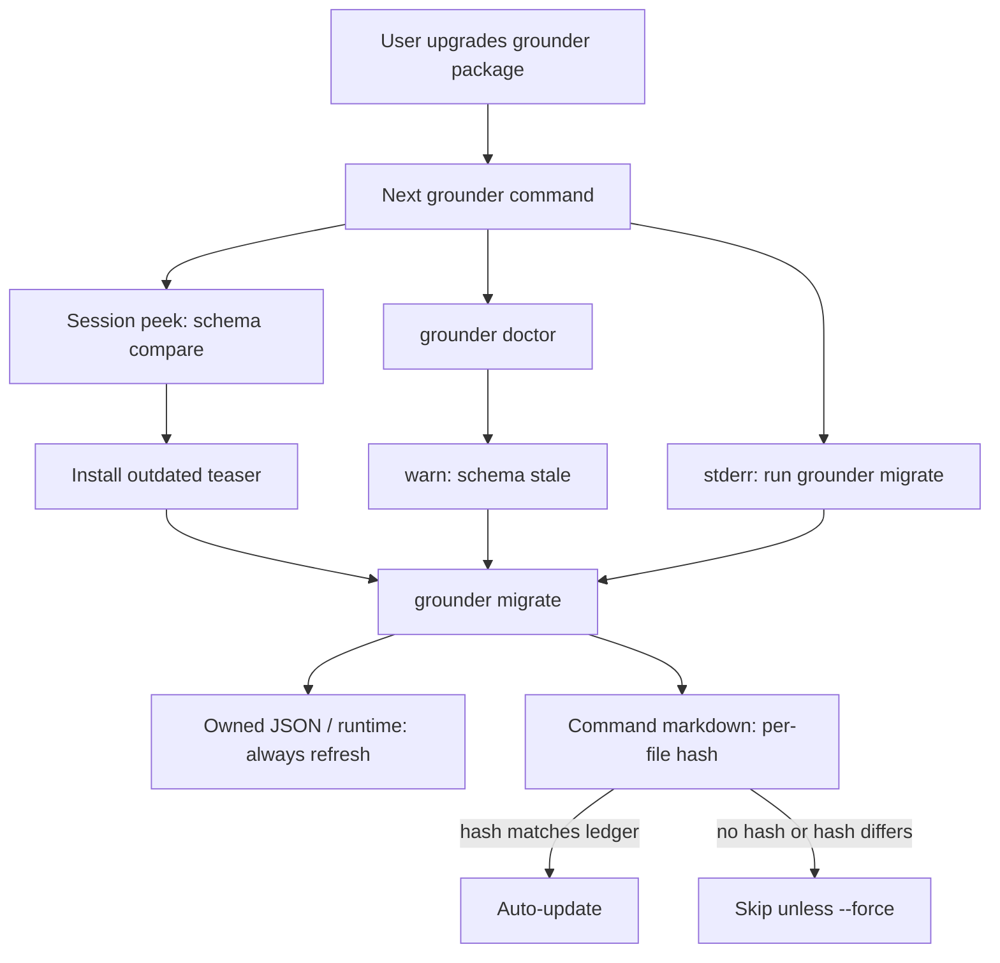

# Schema versioning and install migration

How Grounder keeps agent install artifacts in sync after a package upgrade — and why the design looks this way.

User-facing steps (`grounder migrate`, doctor hints, `--force`) live in [packages/grounder/README.md](../../packages/grounder/README.md). This doc is for contributors.

## Problem

Upgrading the `grounder` npm package does not automatically refresh files already written on the machine (slash commands, hook fragments, `~/.grounder/runtime`). Those artifacts can drift from what the new binary expects.

Early versions relied on ad-hoc detection (e.g. regex sniffing for `npx` in command files) and told users to re-run `vault init --force`. That conflated first-time setup with routine upgrades, clobbered hand-edited commands unless the user opted in carefully, and had no clean answer for “this machine was touched by a *newer* grounder than the binary currently running.”

## What is versioned

Grounder writes several persistent artifacts. They need **different** upgrade rules:

| Artifact | Owner | Location | User-editable? | Upgrade rule |
| --- | --- | --- | --- | --- |
| Slash command markdown | Grounder-generated | `~/.cursor/commands/grounder-*.md`, `~/.claude/commands/grounder-*.md` | Yes (by design) | Hash-safe update; `--force` if edited |
| Hook config fragment | Grounder-owned key in a shared file | Cursor `hooks.json` / Claude `settings.json` | No (that nested entry) | Always regenerate on install/migrate |
| Runtime materialization | Grounder-owned | `~/.grounder/runtime/` | No | Always refresh |
| Home config | Grounder-owned | `~/.grounder/config.json` | Path may be hand-edited | Not schema-migrated here |
| Repo marker | Grounder-owned, often committed | `.grounder.json` (`version` + `projectId`) | Rarely | Forward-compat hard stop if `version` too new |
| Install ledger | Grounder-owned | `~/.grounder/state.json` | No | Written by vault init / migrate |

The important split is **owned JSON / runtime** vs **user-editable markdown**. The rest of the design follows from that.

## Prior art (why these analogies)

| Precedent | Idea we reuse |
| --- | --- |
| **git** `repositoryformatversion` | Old binary meets newer on-disk schema → refuse rather than guess |
| **npm** `lockfileVersion` | Fully owned files may be rewritten in place on the next “install” |
| **chezmoi** apply hashes | Record what we last wrote; if on-disk still matches, safe to overwrite; if not, conflict |
| **Rails `app:update` / Angular `ng update`** | Scaffolding and upgrading generated files are different verbs |
| **Home Assistant config-entry migrations** | Integer schema on owned state; bump + transform (here: regenerate) without user ceremony |

We do **not** pin a per-project Grounder version (Corepack-style). Install state is machine-global (`~/.grounder/`), while `.grounder.json` only needs a small forward-compat guard because it may live in old commits.

## Design

### Two migration strategies

1. **Owned fragments** (hooks entry, runtime, ledger): always refresh on `vault init` / `migrate`. No `--force` required.
2. **Command markdown**: chezmoi-style drift detection.
   - On write, record `sha256` of the exact bytes Grounder wrote (rendered template, including machine-specific CLI path — **not** the raw template).
   - Later: on-disk hash == recorded hash → file untouched → safe auto-update to the new template without `--force`.
   - On-disk hash != recorded (or no recorded hash) → treat as user-edited / legacy → leave alone; report; require `--force` to overwrite.

Missing ledger or missing per-file hash is **schema 0 / legacy**: same protective path as “user edited,” which is why a one-time `migrate --force` is needed when upgrading from pre-ledger installs.

### Adapter-declared schemas

Each `AgentAdapter` exposes:

- `commandsSchema` — bump when `install()` contract changes (placeholders, file set, frontmatter).
- `hooksSchema` (optional) — bump when `installHooks()` contract changes.

Values are compile-time constants next to the install code (`cursor.ts`, `claude.ts`), not a hand-maintained table elsewhere. They are recorded into the ledger so doctor and hooks can compare integers instead of sniffing file contents.

Per-agent granularity costs a little bookkeeping; it pays off when Cursor and Claude templates diverge in timing. Today both agents often bump together — that is fine.

### Ledger: `~/.grounder/state.json`

Module: [`connector/state.ts`](../../packages/grounder/src/connector/state.ts).

```json
{
  "grounderVersion": "0.8.0",
  "agents": {
    "cursor": {
      "commandsSchema": 1,
      "hooksSchema": 1,
      "files": {
        "/Users/x/.cursor/commands/grounder-note.md": {
          "schema": 1,
          "hash": "sha256:…"
        }
      }
    }
  }
}
```

Invariants:

- Missing file or missing agent entry → treat recorded schema as **0** (legacy).
- Recorded schema **less than** this binary’s adapter → stale → user should `grounder migrate`.
- Recorded schema **greater than** this binary’s adapter → **forward-compat hard stop** (`UnsupportedSchemaError`: upgrade grounder). Same idea for `.grounder.json`’s `version` vs `SUPPORTED_REPO_VERSION` in [`connector/repo.ts`](../../packages/grounder/src/connector/repo.ts).
- Corrupt ledger → fail with a clear “fix or remove, then migrate” message (distinct from “newer than me”).
- `migrate` / vault init **must not** advance `commandsSchema` when every command artifact was left as `modified` (legacy or local edits). Runtime/`grounderVersion` (and hooks, when refreshed) may still update; doctor keeps the schema-stale / `--force` hint until a real command write lands.
### `grounder migrate` (not only `vault init --force`)

`vault init` is “point this machine at a vault and install.” Reusing it as the routine post-upgrade action forces retyping a path and mixes first-time setup with keep-current.

`grounder migrate`:

- No vault path — reads home config (points at `vault init` if missing).
- Agents: explicit `--agent`, else keys already in the ledger, else auto-detect (legacy).
- Shares install implementation with `vault init` via [`apply-agent-installs.ts`](../../packages/grounder/src/commands/apply-agent-installs.ts).
- `--dry-run`, `--force`, `--hooks` as documented in the package README.

`vault init --force` remains supported for existing scripts; it calls the same path.

### How users learn they need to migrate

Three channels, no new product surface:

| Channel | Role |
| --- | --- |
| **`grounder doctor` / `status`** | Pull: install-state check, schema stale → warn + migrate hint; schema ahead → fail / upgrade; `status` shows State path |
| **Session hook / `handoff peek`** | Push: cheap integer stale check; one-line teaser (`Install outdated — run: grounder migrate`). Hooks stay side-effect-free — no auto-migrate |
| **CLI upgrade banner** | When running Grounder and the version recorded for this machine's configuration disagree (semver-ordered when both parse as `x.y.z`): plain-language stderr on ordinary commands until migrate/vault init rewrites the ledger. Updated package → migrate; older package → install a newer Grounder; unparseable mismatch → migrate. Skipped for peek, migrate, and vault init |



## Key code map

| Concern | Location |
| --- | --- |
| Install "out of date?" helpers | `connector/state.ts` — `isInstallSchemaStale` for peek/status (state file only; hooks never enabled ≠ out of date). `isHooksSchemaBehind` for doctor when hook files already exist |
| Shared “newer schema” error type | `connector/unsupported-schema.ts` |
| Repo marker version guard | `connector/repo.ts` |
| Hash of rendered command bytes | `util/hash.ts` + `agents/install-command.ts` |
| Adapter schema fields | `agents/types.ts`, `cursor.ts`, `claude.ts` |
| Shared install + ledger update | `commands/apply-agent-installs.ts`, `agents/index.ts` (`recordAgentInstallState`) |
| `grounder migrate` | `commands/migrate.ts` |
| Doctor / status checks | `commands/doctor.ts`, `commands/status.ts` |
| Peek teaser | `commands/handoff/peek.ts` |
| Upgrade banner | `commands/upgrade-banner.ts`, `commands/package-version-notice.ts`, `util/semver.ts`, wired from `cli.ts` |

## Rejected alternatives

- **Only `vault init --force` for upgrades** — wrong verb; requires vault path; trains users to force-clobber.
- **Auto-migrate from the session hook** — hooks must stay fast and side-effect-free.
- **Name the command `upgrade`** — confuses with upgrading the npm package itself.
- **Compare on-disk files to shipped templates** — rendered output is machine-specific (`{{GROUNDER_CLI}}`); only “bytes we last wrote” is a valid hash baseline.
- **Content sniffing for every future migration** — does not scale; ledger + integer schemas replace one-off detectors after the legacy bootstrap.

## Maintainer checklist

When changing install output:

1. Bump `commandsSchema` and/or `hooksSchema` on the affected adapter(s).
2. Ensure install still records per-file hashes for command markdown.
3. Extend doctor messages if a new failure mode needs a distinct hint.
4. Run `pnpm check`.
5. After release, users with an existing ledger run plain `grounder migrate`; pre-ledger installs may need one `migrate --force`.
